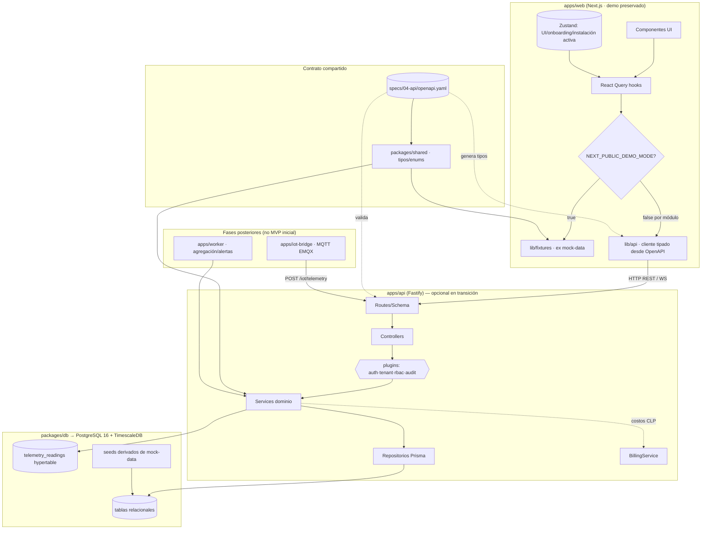

# Plan de Transición Backend — SmartSense

> Deriva de `docs/architecture/migration-strategy.md` (Estrategia A), `specs/06-backend/backend-architecture.md`, `specs/_canon.md`, `specs/04-api/openapi.yaml` y `docs/audit/_evidence-brief.md`.
> Objetivo: incorporar backend a un demo que hoy es 100% mock + localStorage, **sin romper la demo y sin implementar todavía**. Este documento es diseño de transición; no contiene código.

---

## 1. Punto de partida

El demo no tiene backend: ni ORM, ni DB, ni API routes, ni auth (evidencia). El contrato ya existe: `specs/04-api/openapi.yaml` (32 paths / 68 schemas) y el canon define el stack objetivo (Fastify + Prisma + PostgreSQL 16/TimescaleDB, monorepo pnpm). El reto es introducir ese backend de forma que la demo siga viva mientras el frontend conmuta módulo a módulo (ver `migration-strategy.md` §5).

---

## 2. Opciones de incorporación del backend

### (a) Monorepo pnpm: `apps/web` + `apps/api` (Fastify)  ✅ RECOMENDADA

Migrar el demo a un workspace pnpm y añadir `apps/api` (Fastify) junto a `apps/web` (Next.js), con `packages/shared` y `packages/db` compartidos.

- **Pros:** alineada **exactamente** con el canon (§Stack canónico declara este monorepo); tipos y enums compartidos en `packages/shared` (espejo del canon) → contrato único entre web y api; `packages/db` centraliza Prisma/migraciones/seeds; permite añadir `apps/iot-bridge` y `apps/worker` sin reestructurar; CI unificado.
- **Cons:** requiere migrar el repo del demo a estructura de workspace (mover el demo actual a `apps/web`); algo de setup inicial de tooling pnpm/turbo.

### (b) Next.js API routes (temporal)

Servir endpoints desde `app/api/*` del propio Next.js durante la transición.

- **Pros:** cero infra nueva; rápido para un primer "backend de mentira" tipado.
- **Cons:** **diverge del canon** (Fastify, capas estrictas, plugins de tenant/RBAC/audit); no soporta naturalmente WebSocket en vivo, worker de agregación, ni iot-bridge MQTT; obligaría a reescribir todo al migrar a Fastify. Útil a lo sumo como stub efímero, no como destino.

### (c) Fastify separado, sin monorepo

Repo/carpeta independiente para la API Fastify, fuera del workspace del frontend.

- **Pros:** separación física total.
- **Cons:** **no comparte tipos/enums** con el frontend (duplicación y drift garantizado); el canon explícitamente pide monorepo con `packages/shared`; coordinación de versiones y CI más frágil; pierde el beneficio central de un contrato tipado compartido.

### Decisión

**(a) Monorepo pnpm.** Es la única opción alineada al canon y la única que sostiene el roadmap completo (api + worker + iot-bridge + db + shared) sin reescritura. (b) se descarta como destino (a lo sumo stub puntual); (c) se descarta por drift de tipos y contradicción con el canon.

---

## 3. Estructura futura del monorepo

```
smartsense/                       (raíz del workspace pnpm + pnpm-workspace.yaml + turbo)
├── apps/
│   ├── web/                       # Next.js App Router (el demo migrado; ver frontend-transition-plan.md)
│   ├── api/                       # Fastify (HTTP/REST + WebSocket). Núcleo de negocio.
│   │   └── src/
│   │       ├── modules/           # 1 módulo por bounded context: auth, installations, devices,
│   │       │                      #   telemetry, billing, dashboard, reports, breakdown, alerts,
│   │       │                      #   recommendations, control, notifications, audit
│   │       │                      #   cada uno: .routes / .controller / .service / .repository / .schema / .events
│   │       ├── plugins/           # auth · tenant-scope · rbac · audit-hook · error-handler · rate-limit · ws
│   │       ├── jobs/              # registro de jobs (ejecución en worker)
│   │       ├── lib/              # event-bus, logger (pino), prisma-client wrapper, config
│   │       └── server.ts
│   ├── worker/                    # scheduler + consumidores de cola (agregación, alertas, proyección, offline)
│   └── iot-bridge/                # suscriptor MQTT (EMQX) → normaliza → POST /iot/telemetry
└── packages/
    ├── shared/                    # tipos/DTO/enums (espejo del canon), utilidades event_hash;
    │                              #   FUENTE de los tipos que apps/web consume vía lib/api
    └── db/                        # schema Prisma, migraciones, seeds, helpers Timescale (continuous aggregates, políticas)
```

> El demo actual se mueve íntegro a `apps/web`. `apps/worker` e `apps/iot-bridge` se crean cuando entran telemetría/agregación reales; no son requisito de las primeras fases (la demo no tiene telemetría real).

---

## 4. Contrato OpenAPI como eje y generación de tipos

- `specs/04-api/openapi.yaml` (3.1, 32 paths / 68 schemas) es el **contrato único**. Ni el frontend ni el backend definen shapes ad-hoc.
- **Backend:** los schemas de Fastify (`<mod>.schema.ts`, Zod/JSON Schema) validan request/response **contra** el contrato; los DTO viven en `packages/shared`.
- **Frontend:** `apps/web/lib/api` se **genera desde el mismo `openapi.yaml`** (tipos vía `openapi-typescript` + cliente `fetch` tipado). Mismo contrato → mismos tipos en web y api.
- **Fixtures tipadas:** `apps/web/lib/fixtures` (ex `mock-data`) se tipa con los tipos generados, de modo que mock y API real comparten shape y cualquier drift rompe el build (ver `frontend-transition-plan.md` §5).

---

## 5. Persistencia: Prisma + PostgreSQL/TimescaleDB

- **Prisma** en `packages/db`: schema único (21 tablas del canon, `snake_case` plural, PK `id` UUID v7 salvo telemetría), migraciones versionadas, seeds. `apps/api` y `apps/worker` comparten este paquete.
- **PostgreSQL 16 + TimescaleDB:** `telemetry_readings` como **hypertable** (PK lógica `(device_id, source_timestamp, reading_id)`, idempotencia por `UNIQUE(event_hash)`). Agregados materializados vía **continuous aggregates** de Timescale (capa 1) + rollup/costeo en worker (capa 2), como define `backend-architecture.md` §6.
- **Costos siempre en backend:** `BillingService.computeCost()` es el único punto kWh→CLP (canon §invariantes). El frontend solo renderiza valores ya calculados.
- **Multi-tenant:** toda query scoped por `organization_id` vía `tenant-scope` plugin + `TenantContext`. Ninguna query cruza tenants.

---

## 6. Seeds derivados de los mocks

El `lib/mock-data.ts` actual es datos deterministas alineados al deck → es la **fuente natural de los seeds** de catálogo y de la instalación demo:

| Mock demo | Seed objetivo (`packages/db`) | Tabla canon |
|---|---|---|
| tarifa CGE Coquimbo 165 CLP/kWh (BT-1/BT-1A, comuna, distribuidora) | catálogo de tarifas + distribuidoras | `tariffs`, `distributors` |
| firmaElectrica (Refrigeración 38%, Climatización 24%, Electrónica 14%, Iluminación 12%, Lavado 12%) | catálogo de categorías de dispositivo | `device_categories` |
| 4 enchufes (online/offline/reconectando) | dispositivos de la instalación demo | `devices`, `device_pairings` |
| consumoHoy / serieHoraria / serieMesAcumulada | agregados de la instalación demo | `energy_aggregates` (+ telemetría seed) |
| 3 alertas (anomalia/sugerencia/tip) | alertas + recomendaciones demo | `alerts`, `recommendations` |
| reporteSemanal | derivable de agregados | `energy_aggregates` |
| onboardingDone | instalación demo con onboarding completo | `installations`, `installation_profiles` |

> Seeds de **catálogo global** (`device_categories`, `distributors`, `tariffs`) son reutilizables en todos los entornos. Seeds de **instalación demo** (org/user/installation/devices/alerts) reproducen exactamente el escenario del deck para que la demo conectada a API real se vea idéntica a la demo mock.

---

## 7. Migraciones

- Prisma Migrate en `packages/db`. Orden: (1) extensiones (`uuid`, `timescaledb`); (2) catálogos globales; (3) tablas de tenant (users/orgs/memberships/installations…); (4) telemetría + conversión de `telemetry_readings` a hypertable; (5) continuous aggregates y políticas de refresh (helpers Timescale fuera del alcance de Prisma puro, vía SQL en migración).
- Las migraciones no afectan a la demo en modo mock: mientras `DEMO_MODE=true`, el frontend no toca la DB. La DB solo se vuelve obligatoria para los módulos ya en Fase 3.

---

## 8. Testing

Según `backend-architecture.md` §13:
- **Unit:** servicios de dominio con repositorios y puertos (MQTT/email/S3) mockeados. Cubre invariantes: no-cross-tenant, costo determinista, idempotencia por `event_hash`.
- **Integration:** API + Prisma contra PostgreSQL/TimescaleDB efímero (testcontainers). Cubre ingestión idempotente, rollup con costeo, scoping multi-tenant e2e, control con auditoría.
- **Contrato:** validación de payloads contra `openapi.yaml` y contra el contrato de telemetría. **Este es el puente con el frontend:** los mismos tests de contrato garantizan que las fixtures del frontend y las respuestas reales de la API son intercambiables (paridad que habilita el cambio de `DEMO_MODE`).
- CI: lint + unit + integration en GitHub Actions.

---

## 9. Convivencia mock mode ↔ API mode

Principio rector: **el backend es opcional durante toda la transición.** La demo nunca depende de que la API esté arriba.

| Aspecto | Mock mode (`DEMO_MODE=true`) | API mode (`DEMO_MODE=false`, por módulo) |
|---|---|---|
| Fuente de datos del frontend | `apps/web/lib/fixtures` | `apps/web/lib/api` → `apps/api` (Fastify) |
| ¿Backend corriendo? | No requerido | Requerido para ese módulo |
| ¿DB? | No | Sí (Prisma + Postgres/Timescale) |
| Tipos | Generados desde OpenAPI (compartidos) | Generados desde OpenAPI (compartidos) |
| Conmutación | En la `queryFn` de cada hook React Query | Idem; por módulo, no global |

- El flag vive en el frontend (`NEXT_PUBLIC_DEMO_MODE`); el backend no sabe del flag. Un módulo conmuta a API real cuando su endpoint existe, tiene test de contrato verde y hay paridad visual (ver `migration-strategy.md` §5).
- Durante la transición coexisten módulos en fixtures y módulos contra API real sin que la demo deje de funcionar.

---

## 10. Diagrama de la arquitectura de transición



---

## 11. Secuencia de incorporación (sin implementar aún)

1. **Workspace:** convertir el repo del demo en monorepo pnpm; mover demo a `apps/web`; crear `packages/shared` y `packages/db` (vacíos/estructurales).
2. **Contrato → tipos:** generar tipos en `apps/web/lib/api` desde `openapi.yaml`; tipar `lib/fixtures` con ellos. (Frontend sigue 100% mock; demo intacta.)
3. **`apps/api` esqueleto:** Fastify + plugins (auth/tenant/rbac/audit/error/rate-limit/ws) + módulos vacíos; health check. Sin tocar la demo.
4. **`packages/db`:** schema Prisma del canon + migraciones + seeds derivados del mock (catálogos + instalación demo).
5. **Módulo a módulo:** implementar endpoints en orden del frontend-transition-plan (dashboard → breakdown → reports → alerts → settings → auth → onboarding → control → V1), con tests unit+integration+contrato; conmutar `DEMO_MODE=false` para cada módulo solo tras paridad verde.
6. **Telemetría real (posterior):** `apps/iot-bridge` + `apps/worker` + hypertable + continuous aggregates, cuando entre IoT real.

---

*Referencias: `specs/06-backend/backend-architecture.md`, `specs/_canon.md`, `specs/04-api/openapi.yaml`, `docs/architecture/migration-strategy.md`, `docs/architecture/frontend-transition-plan.md`, `docs/audit/_evidence-brief.md`.*
