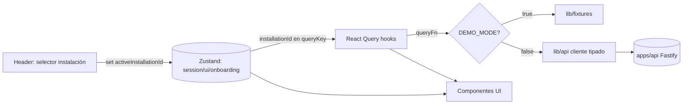

# Plan de Transición Frontend — SmartSense (apps/web)

> Deriva de `docs/architecture/migration-strategy.md` (Estrategia A + toque B-lite), `specs/05-frontend/routes.md`, `specs/_canon.md` y `docs/audit/_evidence-brief.md`.
> Objetivo: llevar el demo actual (rutas español, mock por import directo, localStorage como estado) a la estructura objetivo del canon **sin reescribir componentes y sin romper la demo**.
> No se implementa código en este documento: es el diseño de la transición.

---

## 1. Estructura objetivo de carpetas (`apps/web`)

```
apps/web/
├── app/
│   ├── layout.tsx                          # root: providers (React Query, Zustand hydration, Tailwind, lang="es-CL")
│   ├── (public)/                           # route group sin shell autenticado
│   │   ├── layout.tsx                      # layout minimal centrado (logo + card)
│   │   ├── login/page.tsx
│   │   └── register/page.tsx
│   ├── (onboarding)/
│   │   ├── layout.tsx                      # stepper de progreso (FR-ONB-007)
│   │   └── onboarding/
│   │       ├── scan-kit/page.tsx
│   │       ├── pair-devices/page.tsx
│   │       ├── installation-type/page.tsx
│   │       ├── profile/
│   │       │   ├── home/page.tsx
│   │       │   ├── smb/page.tsx
│   │       │   └── business/page.tsx
│   │       └── bill-upload/page.tsx
│   ├── (dashboard)/                         # shell autenticado: sidebar 8 módulos + header
│   │   ├── layout.tsx
│   │   ├── dashboard/page.tsx
│   │   ├── reports/page.tsx
│   │   ├── breakdown/page.tsx               # detalle device vía ?device=
│   │   ├── control/page.tsx
│   │   ├── alerts/page.tsx
│   │   ├── projections/page.tsx             # V1
│   │   ├── smart-control/page.tsx           # V1
│   │   └── settings/page.tsx
│   ├── demo/page.tsx                        # solo bajo DEMO_MODE (IPhoneFrame wrapper)
│   └── offline/page.tsx                     # fallback PWA (KEEP)
├── components/
│   ├── layout/                              # shell, sidebar, header, nav
│   ├── dashboard/                           # widgets de /dashboard
│   ├── reports/                             # widgets de /reports
│   ├── breakdown/                           # widgets de /breakdown
│   ├── control/                             # widgets de /control y /smart-control
│   ├── alerts/                              # widgets de /alerts
│   ├── onboarding/                          # pasos del wizard
│   ├── shared/                              # presentacionales transversales (RayoSvg, etc.)
│   └── ui/                                  # primitivos shadcn-like (badge, button, card, dialog, input, select)
└── lib/
    ├── api/                                 # cliente HTTP tipado generado desde openapi.yaml + hooks de fetching
    ├── domain/                              # tipos de dominio (espejo de packages/shared / OpenAPI schemas)
    ├── formatters/                          # formatCLP, formatKwh, formatDelta, formatHora (migra desde lib/format.ts)
    ├── validators/                          # validación de inputs en el perímetro (zod, espejo de schemas API)
    ├── fixtures/                            # mock determinista (migra desde lib/mock-data.ts) — ÚNICO consumidor del mock
    ├── stores/                              # Zustand: estado UI + onboarding + instalación activa
    └── hooks/                               # hooks de UI y composición (useOnboarding, usePeriodo, useActiveInstallation)
```

> `components/ui/` se mantiene como categoría aunque no aparezca explícita en el enunciado: son los primitivos del design system y son la base de todos los demás. Es deuda nula y se conserva tal cual.

---

## 2. Mapeo de los 19 componentes actuales → estructura objetivo

| # | Componente actual | Destino | Acción | Nota |
|:--:|---|---|---|---|
| 1 | `components/ui/badge.tsx` | `components/ui/badge.tsx` | **MANTENER** | Primitivo, sin cambios |
| 2 | `components/ui/button.tsx` | `components/ui/button.tsx` | **MANTENER** | |
| 3 | `components/ui/card.tsx` | `components/ui/card.tsx` | **MANTENER** | |
| 4 | `components/ui/dialog.tsx` | `components/ui/dialog.tsx` | **MANTENER** | |
| 5 | `components/ui/input.tsx` | `components/ui/input.tsx` | **MANTENER** | |
| 6 | `components/ui/select.tsx` | `components/ui/select.tsx` | **MANTENER** | |
| 7 | `components/layout/LayoutShell.tsx` | `components/layout/` | **MOVER** | Se convierte en base del layout de `(dashboard)` |
| 8 | `components/layout/Sidebar.tsx` | `components/layout/` | **MOVER + AMPLIAR** | Hoy 5 items; pasa a 8 módulos del canon. Quitar footer hardcodeado "3/4 conectados" (dato debe venir de estado) |
| 9 | `components/layout/BottomNav.tsx` | `components/layout/` | **MOVER** | Nav móvil; alinear a 8 módulos |
| 10 | `components/layout/IPhoneFrame.tsx` | `components/layout/` | **MANTENER (solo demo)** | Wrapper visual; solo se monta en `/demo` bajo `DEMO_MODE` |
| 11 | `components/dashboard/HeroNumerico.tsx` | `components/dashboard/` | **MOVER + DESACOPLAR** | Quitar import de `mock-data` (consumoHoy); recibir datos vía React Query |
| 12 | `components/dashboard/ProyeccionMes.tsx` | `components/dashboard/` | **MOVER + DESACOPLAR** | Idem (consumoHoy → API) |
| 13 | `components/dashboard/AlertasStrip.tsx` | `components/dashboard/` | **MOVER + DESACOPLAR** | Idem (alertas → API) |
| 14 | `components/dashboard/QuickActions.tsx` | `components/dashboard/` | **MOVER** | Sin acoplamiento a mock |
| 15 | `components/onboarding/Step1QR.tsx` | `components/onboarding/` | **MOVER → scan-kit** | Mapea a `/onboarding/scan-kit` |
| 16 | `components/onboarding/Step2PairingLeds.tsx` | `components/onboarding/` | **MOVER → pair-devices** | Mapea a `/onboarding/pair-devices`. Corregir warning exhaustive-deps |
| 17 | `components/onboarding/Step3Tarifa.tsx` | `components/onboarding/` | **MOVER → bill-upload/profile** | Tarifa se reparte entre `installation-type`/`profile`/`bill-upload` del wizard ampliado |
| 18 | `components/shared/RayoSvg.tsx` | `components/shared/` | **MOVER** | Presentacional, sin cambios |
| 19 | `components/theme/ThemeToggle.tsx` | `components/shared/` | **MOVER** | Consolidar `theme/` dentro de `shared/` |

**Carpetas nuevas a crear** (sin componente actual que migrar; se poblarán al migrar las páginas correspondientes): `components/reports/`, `components/breakdown/`, `components/control/`, `components/alerts/`. Los widgets se extraerán de las páginas español actuales (`app/reporte`, `app/desglose`, `app/alertas`) al migrarlas.

---

## 3. Renombrado de rutas (español → inglés) con redirects

| Ruta actual (ES) | Ruta objetivo (EN) | Route group | Redirect permanente |
|---|---|---|---|
| `/` | `/dashboard` (o landing→login) | `(dashboard)` | `/` → destino según sesión |
| `/dashboard` | `/dashboard` | `(dashboard)` | n/a (ya coincide) |
| `/desglose` | `/breakdown` | `(dashboard)` | `/desglose` → `/breakdown` |
| `/alertas` | `/alerts` | `(dashboard)` | `/alertas` → `/alerts` |
| `/reporte` | `/reports` | `(dashboard)` | `/reporte` → `/reports` |
| `/ajustes` | `/settings` | `(dashboard)` | `/ajustes` → `/settings` |
| `/onboarding` | `/onboarding/scan-kit` (+ subrutas) | `(onboarding)` | `/onboarding` → `/onboarding/scan-kit` |
| `/demo` | `/demo` | (raíz) | n/a (solo bajo `DEMO_MODE`) |
| `/offline` | `/offline` | (raíz) | n/a (fallback PWA) |
| — | `/login`, `/register` | `(public)` | nuevas |
| — | `/control`, `/projections`, `/smart-control` | `(dashboard)` | nuevas (projections/smart-control = V1) |

> Los redirects viven en `next.config.js` (`redirects()`) o `middleware.ts`. Son **permanentes** para no romper la demo desplegada, QR de pitch ni enlaces compartidos. El texto/UI sigue en español (`lang="es-CL"`); solo las **URLs** se anglifican según el canon.

---

## 4. Qué se elimina y qué se conserva solo para demo

**Se elimina (deuda/ruido, no productivo):**
- Import directo de `@/lib/mock-data` en los 7 sitios (se reemplaza por capa de datos).
- Footer hardcodeado de `Sidebar.tsx` ("3/4 conectados, 1/4 reconectando") — pasa a derivarse de estado real/fixture.
- Artefactos de raíz no productivos (capture-*.mjs/js, validate-*.sh, *.log, journey-report.json, onboarding-report.json) — fuera de `apps/web`.

**Se conserva solo para demo (bajo `NEXT_PUBLIC_DEMO_MODE`):**
- `IPhoneFrame.tsx` y la ruta `/demo`: encapsulan la presentación tipo dispositivo para pitch. No se montan en el flujo productivo; el shell `(dashboard)` real no los usa.
- `lib/fixtures` (ex `mock-data`): es la fuente de datos cuando `DEMO_MODE=true`.

**Se conserva siempre (production-grade):**
- Todos los primitivos `ui/`, el design system, la PWA (`sw.js`, manifest, `/offline`).
- `lib/format.ts` → `lib/formatters/` sin cambios funcionales.

---

## 5. Introducción del API client (`lib/api`)

- `lib/api` contiene un **cliente HTTP tipado generado desde `specs/04-api/openapi.yaml`** (32 paths / 68 schemas). Generación con `openapi-typescript` (tipos) + un wrapper de `fetch` tipado, o `openapi-fetch`. Resultado: funciones por `operationId` con request/response tipados contra el contrato.
- Los tipos de dominio derivados del OpenAPI alimentan también `lib/domain` y `lib/fixtures`, de modo que **mock y API comparten el mismo shape**. Un cambio de contrato rompe la compilación de las fixtures (drift detectado en build).
- Sobre `lib/api` se montan **hooks de React Query** (`useDashboard`, `useBreakdown`, `useAlerts`, …) que encapsulan `queryKey` (incluyendo la `installationId` activa) e invalidación.

---

## 6. Manejo de `DEMO_MODE`

- Flag: `NEXT_PUBLIC_DEMO_MODE` (`"true"` por defecto durante la transición).
- **Conmutación en la capa de datos**, no en los componentes. Cada hook de React Query (`lib/api`) resuelve su `queryFn` según el flag:
  - `DEMO_MODE=true` → la `queryFn` devuelve datos de `lib/fixtures` (resuelve una promesa con el fixture tipado; puede simular latencia).
  - `DEMO_MODE=false` → la `queryFn` llama al cliente tipado real (`apps/api`).
- La conmutación es **por módulo**: el flag puede ser global, pero la migración real avanza módulo a módulo (un hook ya cableado a API real ignora el flag para su recurso). Esto permite que la demo siga 100% en fixtures mientras `dashboard` ya consume API real, sin romper nada.
- `/demo` e `IPhoneFrame` solo se renderizan si `DEMO_MODE=true`.

---

## 7. Evitar localStorage como fuente principal de estado

| Tipo de estado | Hoy | Objetivo |
|---|---|---|
| Estado de servidor (consumo, alertas, reportes, desglose, devices) | Import directo de mock | **React Query** (caché, invalidación, `queryKey` con `installationId`) |
| Estado de UI (tema, navegación, modales) | `ThemeContext` + localStorage `theme` | **Zustand** (slice `ui`); localStorage solo como *persist middleware* secundario para tema |
| Estado de onboarding (paso actual, datos del wizard) | localStorage `onboardingDone` | **Zustand** (slice `onboarding`) + guard servidor vía `GET /onboarding/status` |
| Instalación activa | (no existe) | **Zustand** (slice `session.activeInstallationId`), inyectada en `queryKey` de React Query |
| Preferencia de frame demo | localStorage `showIPhoneFrame` | Derivado de `DEMO_MODE` (env), no de localStorage |

- **Regla:** localStorage **nunca** es fuente de verdad de dominio. Se permite solo como capa de persistencia secundaria de preferencias UI (vía middleware `persist` de Zustand para el tema), recuperable y no autoritativa.
- `useLocalStorage<T>` genérico se conserva como utilidad, pero su uso queda restringido a preferencias UI, no a estado de dominio/onboarding.

---

## 8. Cómo se conectan React Query y Zustand

- **Separación de responsabilidades:** React Query = *server state* (datos remotos, asíncronos, cacheables). Zustand = *client state* (UI, sesión, instalación activa, paso de onboarding). No se duplica server state dentro de Zustand.
- **Punto de unión:** la `installationId` activa vive en Zustand (`session` slice). Los hooks de React Query la leen para componer la `queryKey` y la URL del endpoint (`/installations/{installationId}/...`). Al cambiar de instalación en el header, Zustand actualiza el id → React Query refetch automático por cambio de `queryKey`.
- **Hidratación:** `app/layout.tsx` monta `QueryClientProvider` y el boundary de hidratación de Zustand. Las páginas server-component pueden prefetchear con React Query y entregar el estado deshidratado; el dashboard en vivo hidrata en cliente para suscribir WebSocket (NFR-022).



---

## 9. Orden de migración por pantalla

Recorre las fases de `migration-strategy.md` §5 (UI mock → data-access → API client → backend real). Orden recomendado, de menor a mayor riesgo y respetando dependencias:

| Orden | Pantalla | Por qué este orden | Dependencias |
|:--:|---|---|---|
| 1 | **Infra compartida** (`lib/fixtures`, `lib/api`, `lib/stores`, providers en `app/layout.tsx`) | Habilita todo lo demás; erradica los 7 imports directos de mock | OpenAPI generado |
| 2 | **Reorg de shell (B-lite)**: route groups `(public)/(onboarding)/(dashboard)`, redirects ES→EN, Sidebar a 8 módulos | Estructura objetivo sin tocar lógica de datos | 1 |
| 3 | **`/dashboard`** | Pantalla ancla del pitch; 3 de los 7 acoplamientos viven aquí (Hero, Proyección, AlertasStrip) | 1, 2 |
| 4 | **`/breakdown`** (ex `/desglose`) | Solo lectura; un solo acoplamiento (firmaElectrica) | 1, 2 |
| 5 | **`/reports`** (ex `/reporte`) | Solo lectura; un acoplamiento (reporteSemanal) | 1, 2 |
| 6 | **`/alerts`** (ex `/alertas`) | Lectura + acción (review); un acoplamiento (alertas) | 1, 2 |
| 7 | **`/settings`** (ex `/ajustes`) | Lectura + escritura (enchufes, tarifa); dos acoplamientos | 1, 2, auth |
| 8 | **`(public)/login` + `register`** | Introduce auth/sesión real; nuevo, sin demo previa | 1 |
| 9 | **`(onboarding)/*`** (wizard ampliado a scan-kit/pair-devices/installation-type/profile/bill-upload) | Mayor reescritura (3 pasos demo → 8 pasos canon); depende de auth | 1, 8 |
| 10 | **`/control`** | Acciones con RBAC y auditoría; requiere backend de control | backend control |
| 11 | **`/projections`, `/smart-control`** | V1; se dejan al final | backend V1 |

> Cada pantalla se da por migrada cuando renderiza idéntico con fixtures y con API real (paridad visual contra baseline de screenshots Playwright) y el build sigue verde.

---

*Referencias: `docs/architecture/migration-strategy.md`, `specs/05-frontend/routes.md`, `specs/_canon.md`, `docs/audit/_evidence-brief.md`.*
