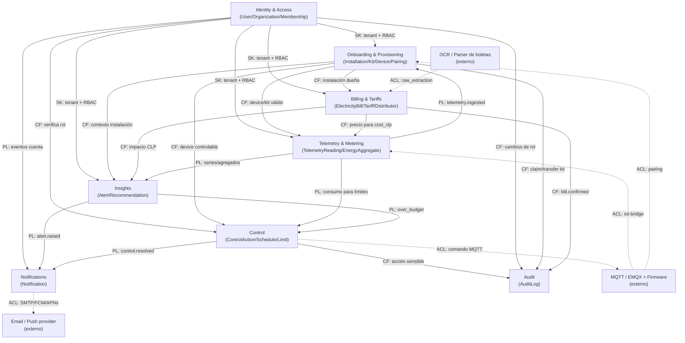

# Bounded Contexts (DDD) — SmartSense

> Deriva de `specs/_canon.md` y `specs/02-domain/domain-model.md`. Define los bounded contexts, su lenguaje ubicuo, dependencias y el context map. Las entidades, tablas y enums son los del canon (no se inventan nombres nuevos).

## Convenciones

- **Tenant** = `Organization`. El aislamiento multi-tenant es invariante transversal a todos los contextos (no es propiedad de uno solo).
- Los **eventos de dominio** usan los nombres ya definidos en `domain-model.md` (`user.registered`, `kit.claimed`, `telemetry.ingested`, etc.).
- **ACL** = Anti-Corruption Layer: traductor que protege el modelo de un contexto frente a modelos externos (broker MQTT, OCR de boletas, proveedor de email/push).
- Cada contexto es dueño de sus tablas (escritura). Otros contextos solo leen vía consultas explícitas o reaccionan a eventos.

---

## 1. Identity & Access

**Responsabilidad:** autenticación, identidad de cuentas, organizaciones (tenants), membresías y RBAC. Es la raíz de autorización para todos los demás contextos.

**Entidades / tablas:** `User` (`users`), `Organization` (`organizations`), `Membership` (`memberships`).

**Lenguaje ubicuo:** cuenta, tenant, organización, membresía, rol (`owner | admin | operator | viewer`), invitación, sesión, token de acceso/refresh, suspensión, plan (`free | pro | enterprise`).

**Invariantes propios:**
- `email` único global; password con hash Argon2id.
- Toda `Organization` mantiene al menos un `Membership` con rol `owner`.
- Un `User` no opera sin al menos una `Membership` `active`.
- Par (`user_id`, `organization_id`) único en `memberships`.

**Dependencias:**
- **Upstream de:** todos los contextos (provee la identidad del actor y el `organization_id` de scoping).
- **Downstream de:** ninguno.

**Eventos publicados:** `user.registered`, `user.logged_in`, `user.password_reset`, `organization.created`, `organization.plan_changed`, `membership.invited`, `membership.accepted`, `membership.role_changed`, `membership.revoked`.

**Eventos consumidos:** ninguno (contexto raíz).

**ACL:** opcional para login social (Google OAuth2) — traduce el perfil externo a `User` interno. Marcado como duda en `domain-model.md`; fuera de MVP por defecto.

---

## 2. Onboarding & Provisioning

**Responsabilidad:** alta de sitios físicos, caracterización por segmento, ciclo de vida del kit IoT (scan/claim/transfer) y emparejamiento de dispositivos.

**Entidades / tablas:** `Installation` (`installations`), `InstallationProfile` (`installation_profiles`), `EnergyKit` (`energy_kits`), `Device` (`devices`), `DeviceCategory` (`device_categories`), `DevicePairing` (`device_pairings`).

**Lenguaje ubicuo:** instalación, sitio, segmento (`home | smb | business`), perfil de instalación, kit, QR, claim, transferencia (`transferring`), dispositivo, capacidad (`meter`/`switch`), emparejamiento (`paired | recommended | scanning | unpaired | error`), categoría de dispositivo, estado de dispositivo (`online | offline | unknown`).

**Invariantes propios:**
- Un `EnergyKit` no puede estar `active` en dos instalaciones a la vez (salvo `transferring` controlado).
- `Device` pertenece a exactamente un `EnergyKit` y denormaliza `installation_id` para scoping.
- El shape de `InstallationProfile.extra` valida contra el `segment` de la instalación.
- `DeviceCategory` es catálogo global (no por tenant).

**Dependencias:**
- **Upstream de:** Telemetry & Metering, Control, Insights, Billing (todos refieren `installation_id`/`device_id`).
- **Downstream de:** Identity & Access (organización dueña), Billing & Tariffs (asigna `distributor_id`/`tariff_id` a la instalación).

**Eventos publicados:** `installation.created`, `installation.tariff_assigned`, `profile.updated`, `kit.scanned`, `kit.claimed`, `kit.transferred`, `device.paired`, `device.online`, `device.offline`, `pairing.started`, `pairing.completed`, `pairing.failed`.

**Eventos consumidos:** `telemetry.ingested` (para actualizar `device.last_seen_at` y derivar `device.state`).

**ACL:** **sí** — frente al broker MQTT/firmware del kit. El `external_ref` y el `qr_code` son identificadores del mundo IoT; el ACL los traduce a `Device`/`EnergyKit` internos durante el pairing, aislando el modelo de dominio del formato del fabricante.

---

## 3. Telemetry & Metering

**Responsabilidad:** ingesta idempotente de lecturas energéticas en tiempo real y materialización de agregados (hora/día/semana/mes) para reportes y desglose.

**Entidades / tablas:** `TelemetryReading` (`telemetry_readings`, hypertable Timescale), `EnergyAggregate` (`energy_aggregates`).

**Lenguaje ubicuo:** lectura, telemetría, ingesta, idempotencia, `event_hash`, `source_timestamp` (origen) vs `received_timestamp` (recepción), potencia activa (W), energía delta (Wh), factor de potencia, estado de ingesta (`accepted | duplicate | invalid`), agregado, bucket, granularidad (`hour | day | week | month`), recálculo, downsampling.

**Invariantes propios:**
- Toda lectura refiere un `device_id` válido asociado a un kit/instalación.
- Consumos no negativos; `source_timestamp` válido y no excesivamente futuro.
- `event_hash` único (idempotencia de ingesta).
- `EnergyAggregate` es recalculable e idempotente por (`installation_id`, `device_id`, `category_id`, `granularity`, `bucket_start`).

**Dependencias:**
- **Upstream de:** Insights (consume series/agregados), Billing (compara consumo medido vs boleta), Control (límites se evalúan contra consumo).
- **Downstream de:** Onboarding & Provisioning (valida device/kit/installation), Billing & Tariffs (necesita tarifa para calcular `cost_clp` del agregado — el costo vive en backend).

**Eventos publicados:** `telemetry.ingested`, `telemetry.rejected`, `aggregate.recomputed`.

**Eventos consumidos:** `device.paired`/`kit.claimed` (para conocer qué devices son válidos), `installation.tariff_assigned` (para recalcular `cost_clp`).

**ACL:** **sí** — el `iot-bridge` actúa como ACL entre MQTT/EMQX y la API: normaliza el `raw_payload` del broker al contrato de `TelemetryReading`, calcula `event_hash` y rechaza payloads inválidos antes de tocar el dominio.

---

## 4. Billing & Tariffs

**Responsabilidad:** boletas eléctricas (carga, parseo, confirmación), catálogo de tarifas y distribuidoras. Fuente de verdad del precio para el cálculo de costos en backend.

**Entidades / tablas:** `ElectricityBill` (`electricity_bills`), `Tariff` (`tariffs`), `Distributor` (`distributors`).

**Lenguaje ubicuo:** boleta, periodo, consumo facturado (kWh), total (CLP), cargo fijo, cargo variable, cargo por demanda, tarifa (AT/BT), distribuidora, estado de boleta (`uploaded | parsed | confirmed`), extracción cruda (`raw_extraction`), archivo original (`file_url`).

**Invariantes propios:**
- La boleta conserva el archivo original o referencia segura (`file_url`).
- `consumption_kwh` y `total_clp` no negativos; `period_end >= period_start`.
- Un cálculo monetario requiere una `Tariff` o una `ElectricityBill` base suficiente.
- `Tariff` puede ser genérica (sin `distributor_id`) o de distribuidora.

**Dependencias:**
- **Upstream de:** Telemetry & Metering (provee precio para `cost_clp`), Insights (impacto monetario de alertas/recomendaciones).
- **Downstream de:** Onboarding & Provisioning (la boleta/tarifa se asocian a una `Installation`).

**Eventos publicados:** `bill.uploaded`, `bill.confirmed`.

**Eventos consumidos:** `installation.created` (vincula distribuidora/tarifa por defecto).

**ACL:** **sí** — frente al motor de OCR/parsing de boletas. El servicio externo entrega texto/JSON crudo (`raw_extraction`); el ACL lo traduce a campos validados (`consumption_kwh`, `total_clp`, etc.) sin que el formato del proveedor contamine el modelo.

---

## 5. Insights

**Responsabilidad:** detección de anomalías y generación de alertas; recomendaciones de ahorro con impacto estimado en CLP.

**Entidades / tablas:** `Alert` (`alerts`), `Recommendation` (`recommendations`).

**Lenguaje ubicuo:** alerta, tipo (`anomaly | high_device | over_budget | offline`), severidad (`info | warning | critical`), estado (`open | reviewed | dismissed`), impacto estimado (CLP), recomendación, fuente (`alert | periodic_analysis`), ahorro estimado, prioridad, estado de recomendación (`new | applied | dismissed`).

**Invariantes propios:**
- Toda alerta tiene severidad y estado.
- Sin tarifa/boleta suficiente no se genera impacto monetario (se omite el campo CLP, no se inventa).
- Una `Recommendation` deriva de una `Alert` o de análisis periódico.

**Dependencias:**
- **Upstream de:** Notifications (alerta/recomendación dispara notificación), Control (`over_budget`/límite puede sugerir/disparar acción).
- **Downstream de:** Telemetry & Metering (consume series/agregados), Billing & Tariffs (necesita precio para `estimated_impact_clp`/`estimated_saving_clp`), Onboarding (contexto de instalación/device).

**Eventos publicados:** `alert.raised`, `alert.reviewed`, `alert.dismissed`, `recommendation.created`, `recommendation.applied`.

**Eventos consumidos:** `telemetry.ingested`, `aggregate.recomputed`, `device.offline` (alerta `offline`), eventos de `consumption_limit` excedido.

**ACL:** no aplica (consume modelos internos propios del producto).

---

## 6. Control

**Responsabilidad:** comandos de control sobre dispositivos (on/off/límite), programaciones horarias y límites de consumo con pre-alerta y acción al exceder.

**Entidades / tablas:** `ControlAction` (`control_actions`), `ControlSchedule` (`control_schedules`), `ConsumptionLimit` (`consumption_limits`).

**Lenguaje ubicuo:** acción de control, tipo (`turn_on | turn_off | set_limit`), estado/resultado (`pending | success | failed | rejected`), programación, regla horaria, límite de consumo, ventana (`day | month`), pre-alerta (%), acción al exceder (`alert | turn_off`).

**Invariantes propios:**
- Toda acción de control requiere rol `operator | admin | owner` sobre la instalación del device.
- Toda `ControlAction` queda auditada en `audit_logs`.
- El resultado siempre es uno de `pending | success | failed | rejected`.
- Solo dispositivos con capacidad `switch` se controlan; límites positivos.

**Dependencias:**
- **Upstream de:** Audit (toda acción se registra), Notifications (resultado puede notificar), Onboarding (envía comando al device vía broker).
- **Downstream de:** Identity & Access (verifica rol), Onboarding (valida que el device existe/es controlable), Insights/Telemetry (límite se evalúa contra consumo).

**Eventos publicados:** `control.requested`, `control.resolved`.

**Eventos consumidos:** `telemetry.ingested`/`aggregate.recomputed` (evaluación de `ConsumptionLimit`), `alert.raised` con tipo `over_budget` (acción `turn_off` automática si así se configuró).

**ACL:** **sí** — el comando se traduce al protocolo del broker/firmware (MQTT) vía el `iot-bridge`; la respuesta del device se normaliza a `result`/`status` antes de resolver la `ControlAction`.

---

## 7. Notifications

**Responsabilidad:** entrega de notificaciones al usuario por canal (in-app/email/push) y estado de lectura.

**Entidades / tablas:** `Notification` (`notifications`).

**Lenguaje ubicuo:** notificación, canal (`in_app | email | push`), título, cuerpo, leída (`read_at`), referencia relacionada (`related_type`/`related_id`).

**Invariantes propios:**
- Toda notificación resuelve su `organization_id` (tenant) y opcionalmente `installation_id`/`user_id`.

**Dependencias:**
- **Upstream de:** ninguno (es sumidero de eventos).
- **Downstream de:** Insights (alertas/recomendaciones), Control (resultados), Identity & Access (eventos de cuenta/membresía).

**Eventos publicados:** `notification.sent`, `notification.read`.

**Eventos consumidos:** `alert.raised`, `recommendation.created`, `control.resolved`, `membership.invited`, `user.password_reset` (y otros que requieran avisar al usuario).

**ACL:** **sí** — frente a proveedores externos de email (SMTP/API) y push (FCM/APNs). El ACL traduce la `Notification` interna al formato del proveedor y mapea callbacks de entrega.

---

## 8. Audit

**Responsabilidad:** bitácora inmutable (append-only) de acciones sensibles: control remoto, cambios de rol, claim/transfer de kit, confirmación de boletas.

**Entidades / tablas:** `AuditLog` (`audit_logs`).

**Lenguaje ubicuo:** bitácora, registro de auditoría, append-only, actor, acción, entidad afectada, before/after, IP, no repudio.

**Invariantes propios:**
- Solo inserción (sin UPDATE/DELETE; protegido por trigger).
- Resuelve siempre `organization_id`; el `user_id` es opcional (acciones de sistema).

**Dependencias:**
- **Upstream de:** ninguno.
- **Downstream de:** todos los contextos que emiten acciones sensibles (especialmente Control e Identity & Access).

**Eventos publicados:** ninguno (registra, no orquesta).

**Eventos consumidos:** `control.requested`/`control.resolved`, `membership.role_changed`/`membership.revoked`, `kit.claimed`/`kit.transferred`, `bill.confirmed`.

**ACL:** no aplica.

---

## 9. Context Map (Mermaid)

Etiquetas de relación: **ACL** (anti-corruption layer), **CF** (customer/supplier: upstream→downstream), **C** (conformist), **PL** (published language vía eventos), **SK** (shared kernel: tenant/RBAC compartido).

## 10. Resumen de relaciones del mapa

| Upstream | Downstream | Patrón | Contrato |
|---|---|---|---|
| Identity & Access | Todos | Shared Kernel (tenant + RBAC) | `organization_id`, rol de `Membership` |
| Onboarding | Telemetry, Insights, Control, Billing | Customer/Supplier | `installation_id` / `device_id` / `kit_id` válidos |
| Telemetry | Insights, Control | Published Language | `telemetry.ingested`, `aggregate.recomputed` |
| Telemetry | Onboarding | Published Language | `telemetry.ingested` → `last_seen_at`/`state` |
| Billing | Telemetry, Insights | Customer/Supplier | precio (`Tariff`/`ElectricityBill`) para CLP |
| Insights | Notifications, Control | Published Language | `alert.raised`, `over_budget` |
| Control | Audit, Notifications | Customer/Supplier + PL | `control.requested`/`control.resolved` |
| Cualquiera sensible | Audit | Customer/Supplier | acción auditable (append-only) |
| MQTT/EMQX | Telemetry, Onboarding | ACL (`iot-bridge`) | normaliza `raw_payload`/`external_ref` |
| OCR/Parser | Billing | ACL | normaliza `raw_extraction` |
| Email/Push provider | Notifications | ACL | traduce `Notification` a payload del proveedor |
