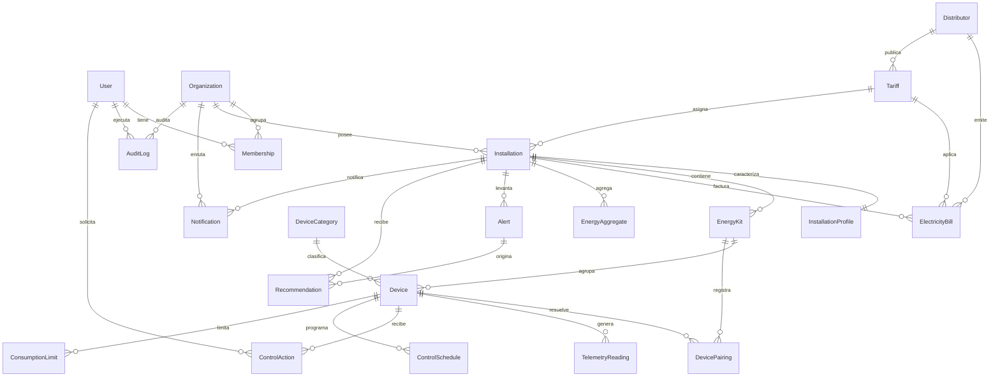

# MER Conceptual — SmartSense

> Modelo entidad-relación conceptual. Ver `specs/02-domain/domain-model.md` para semántica y `relational-model.md` para el modelo físico.

## 1. Diagrama ER (Mermaid)

## 2. Cardinalidades y opcionalidad

| Relación | Cardinalidad | Opcionalidad | Justificación |
|---|---|---|---|
| User–Membership–Organization | N↔N | Membership obligatoria para operar | Una cuenta puede pertenecer a varias organizaciones (multi-tenant). |
| Organization–Installation | 1→N | Installation obligatoria pertenece a 1 org | Una org gestiona múltiples sitios. |
| Installation–InstallationProfile | 1→1 | Profile opcional al crear, requerido para onboarding completo | Caracterización por segmento. |
| Installation–EnergyKit | 1→N | Kit puede existir `unclaimed` sin installation | Una instalación puede tener varios kits; kit pre-claim sin sitio. |
| EnergyKit–Device | 1→N | Device obligatorio pertenece a 1 kit | Un kit agrupa varios dispositivos. |
| Device–TelemetryReading | 1→N | Reading obligatoria refiere device válido | Serie temporal de alta cardinalidad. |
| Device–ControlAction/Schedule/Limit | 1→N | opcionales | Solo dispositivos con `switch` se controlan. |
| DeviceCategory–Device | 1→N | category opcional en Device | Clasificación para desglose. |
| Installation–ElectricityBill | 1→N | boleta obligatoria refiere instalación | Histórico de boletas. |
| Distributor–Tariff | 1→N | tariff puede no tener distributor (genérica) | Catálogo tarifario. |
| Tariff–ElectricityBill | 1→N | tariff opcional en boleta (puede inferirse luego) | Tarifa base del cálculo. |
| Installation–EnergyAggregate | 1→N | agregado obligatorio refiere instalación | Reportes/desglose precalculados. |
| Installation–Alert | 1→N | alerta obligatoria refiere instalación | Alertas por sitio. |
| Alert–Device | N→0..1 | device opcional | Alerta puede ser de instalación o de un device. |
| Alert–Recommendation | 1→N | recommendation puede no tener alert | Recomendación de alerta o de análisis periódico. |
| User–AuditLog / Org–AuditLog | 1→N | user opcional (acciones de sistema) | Bitácora append-only. |

## 3. Reglas críticas del MER

1. Una cuenta (`User`) puede pertenecer a una o más `Organization` (vía `Membership`).
2. Una `Organization` puede tener una o más `Installation`.
3. Una `Installation` representa exactamente un segmento: `home`, `smb` o `business`.
4. Una `Installation` puede tener uno o más `EnergyKit`.
5. Un `EnergyKit` puede tener varios `Device`.
6. Un `Device` puede generar muchas `TelemetryReading`.
7. Una `ElectricityBill` pertenece a una `Installation`.
8. Una `Alert` pertenece a una `Installation` y opcionalmente a un `Device`.
9. Una `Recommendation` deriva de una `Alert` o de análisis periódico (`source`).
10. Toda `ControlAction` se asocia a `User` + `Device` + `status` de resultado.
11. Un `EnergyKit` no puede estar `active` en dos instalaciones simultáneamente (salvo `transferring`).
12. Multi-tenant: toda entidad resuelve su `Organization` y nunca cruza tenants.

## 4. Identificadores conceptuales

- `User.email`, `Organization.legal_id`, `EnergyKit.qr_code`, `Distributor.code` son candidatos naturales únicos además del `id` surrogate.
- `TelemetryReading` se identifica de forma única por `event_hash` (idempotencia de ingesta).
- `EnergyAggregate` único por (`installation_id`, `device_id`, `category_id`, `granularity`, `bucket_start`).
