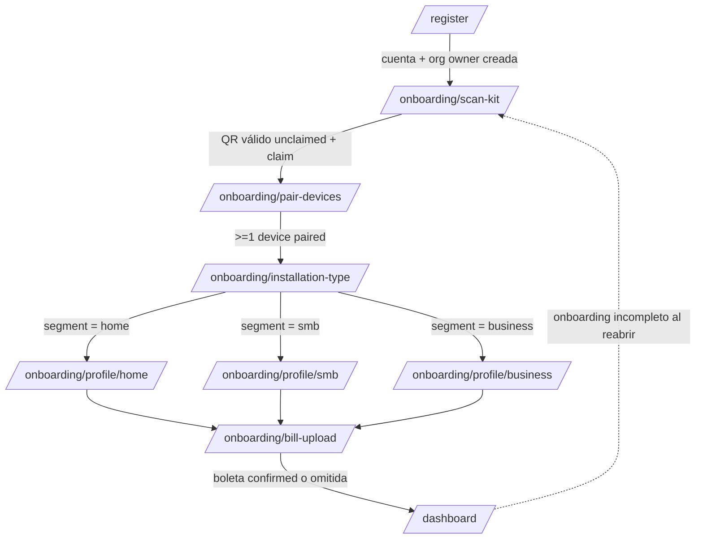
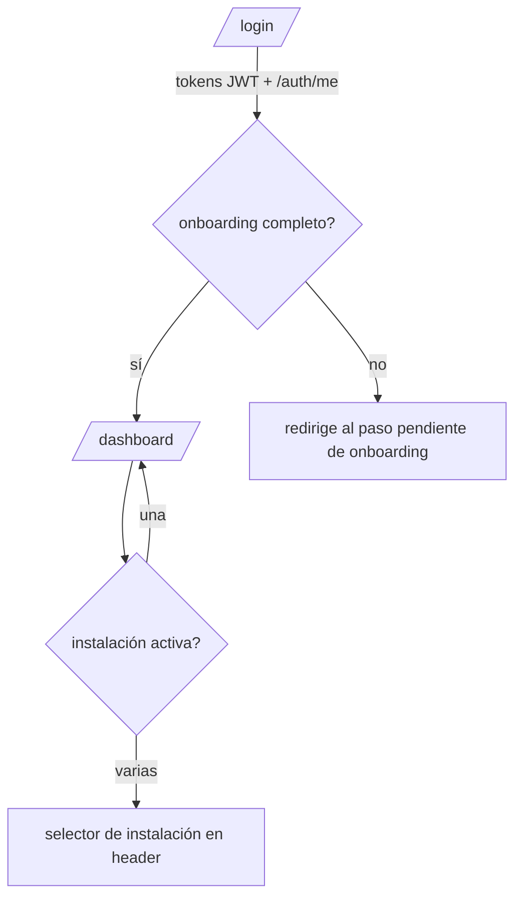
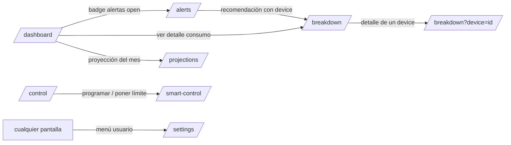
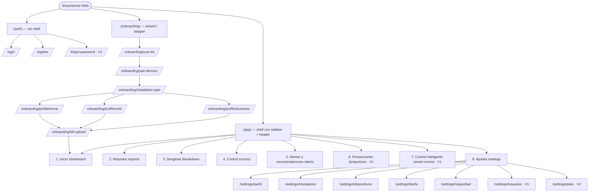

# Arquitectura de Información — Frontend SmartSense

> Deriva de `specs/_canon.md`, `specs/01-requirements/functional-requirements.md`, `specs/04-api/api-overview.md` y `specs/04-api/openapi.yaml`.
> Stack frontend (canon): Next.js App Router + TypeScript + Tailwind + React Query (server state) + Zustand (UI state); gráficos Recharts.
> Idioma de UI: `es-CL`. Moneda: CLP (computada en backend; el frontend solo renderiza).

## 1. Principios de IA (information architecture)

- **Navegación persistente por sidebar lateral** con los 8 módulos visibles de la maqueta, disponible tras completar (o reanudar) el onboarding.
- **Onboarding como flujo lineal aislado** (sin sidebar), tipo wizard, con barra de progreso (FR-ONB-007).
- **Instalación activa como contexto global**: casi toda la data cuelga de `/installations/{installationId}/...`. El selector de instalación vive en el header del shell autenticado.
- **Resiliencia UI (NFR-018):** todas las pantallas deben renderizar sin datos históricos ni telemetría en vivo, mostrando empty states con CTA en vez de errores.
- **RBAC visible:** acciones de control/edición ocultas o deshabilitadas para `viewer` (FR-AUTH-009); el backend siempre revalida (403).
- **Segmento condiciona contenido, no estructura:** `home | smb | business` comparten los 8 módulos; varían etiquetas, perfil de onboarding y énfasis de métricas (ver §5).

## 2. Jerarquía de navegación (sidebar — 8 módulos)

El shell autenticado (`(app)`) expone un sidebar lateral fijo con estos 8 ítems, en este orden:

| # | Ítem sidebar | Ruta | Módulo FR | Rol mínimo | Prioridad |
|---|---|---|---|---|---|
| 1 | Inicio | `/dashboard` | DASH | viewer+ | MVP |
| 2 | Reportes | `/reports` | REP | viewer+ | MVP |
| 3 | Desglose | `/breakdown` | BRK | viewer+ | MVP |
| 4 | Control | `/control` | CTRL (on/off, estado, bitácora) | viewer+ ver · operator+ actuar | MVP |
| 5 | Alertas y recomendaciones | `/alerts` | ALRT + REC | viewer+ ver · operator+ revisar | MVP |
| 6 | Proyecciones | `/projections` | PROJ | viewer+ | V1 |
| 7 | Control inteligente | `/smart-control` | CTRL-004/005/006 (horarios, límites, pre-alertas) | operator+ | V1 |
| 8 | Ajustes | `/settings` | SET | viewer+ (perfil propio) · admin/owner (instalación/usuarios/plan) | MVP (núcleo) |

Notas de agrupación:
- **Control** (módulo 4) cubre acción inmediata y estado en vivo (FR-CTRL-001/002/003/007/008/009).
- **Control inteligente** (módulo 7) cubre la automatización: programación horaria (FR-CTRL-004), límites de consumo (FR-CTRL-005) y pre-alertas (FR-CTRL-006). No existe un módulo FR "smart" propio; se compone de la familia CTRL avanzada.
- **Alertas y recomendaciones** (módulo 5) fusiona ALRT + REC porque la maqueta los presenta en una sola pantalla (pág. 20) y REC deriva de ALRT (FR-REC-001).

Elemento secundario del shell (header, no sidebar):
- **Selector de instalación activa** (cuando el usuario pertenece a varias instalaciones/orgs).
- **Badge de alertas open** (FR-DASH-006) con enlace directo a `/alerts`.
- **Menú de usuario** → atajo a `/settings` y logout (FR-AUTH-004).

## 3. Mapa del sitio

```
SmartSense Web (apps/web)
├── (auth)  ── route group sin shell, layout minimal
│   ├── /login                       FR-AUTH-002
│   ├── /register                    FR-AUTH-001
│   └── /forgot-password (V1)        FR-AUTH-005
│
├── (onboarding) ── wizard lineal, layout con stepper, sin sidebar
│   ├── /onboarding/scan-kit         FR-ONB-001
│   ├── /onboarding/pair-devices     FR-ONB-003/004/005
│   ├── /onboarding/installation-type FR-ONB-006 (+ creación instalación FR-ONB-008)
│   ├── /onboarding/profile/home     FR-PROF-001/002
│   ├── /onboarding/profile/smb      FR-PROF-001/003
│   ├── /onboarding/profile/business FR-PROF-001/004
│   └── /onboarding/bill-upload      FR-BILL-001..007
│
└── (app) ── shell autenticado con sidebar (8 módulos) + header (selector instalación)
    ├── /dashboard                   DASH  (Inicio)
    ├── /reports                     REP
    ├── /breakdown                   BRK
    ├── /control                     CTRL
    ├── /alerts                      ALRT + REC
    ├── /projections                 PROJ
    ├── /smart-control               CTRL-004/005/006
    └── /settings                    SET (perfil, instalación, dispositivos, tarifa, seguridad, usuarios, plan)
```

## 4. Flujos de navegación

### 4.1 Onboarding → Dashboard (camino feliz, primer uso)



Reglas:
- El onboarding se considera completo con kit `active`, ≥1 device `paired` y perfil con datos mínimos (FR-ONB-007). `bill-upload` es recomendado pero **omitible** (sin tarifa el dashboard muestra "tarifa pendiente", FR-DASH-003).
- `GET /onboarding/status` decide el paso de reanudación al entrar a `(app)` o a `(onboarding)`.

### 4.2 Login → Shell (usuario recurrente)



### 4.3 Flujos transversales dentro del shell



## 5. Navegación por segmento (home / smb / business)

Los 8 módulos son comunes a los tres segmentos; el segmento (`installations.segment`) ajusta **contenido y vocabulario**, no la estructura del árbol. El frontend lee el segmento de la instalación activa y lo usa como variante de presentación (Zustand `activeInstallation.segment`).

| Aspecto | home | smb | business |
|---|---|---|---|
| Etiqueta dashboard | "Tu hogar" | "Tu local" | "Tu instalación" |
| Onboarding/perfil | `/onboarding/profile/home` (personas, calefacción) | `/onboarding/profile/smb` (horario comercial, equipos críticos) | `/onboarding/profile/business` (turnos, equipos críticos, potencia declarada) |
| Énfasis dashboard | costo del día, comparación mensual | costo del día + horario operación | potencia vs `declared_power_kw` (riesgo de demanda, FR-PROF-007) |
| Desglose default | por categoría | por dispositivo | por dispositivo + categoría, ranking top-N |
| Proyecciones | costo vs boleta anterior | costo vs boleta + presupuesto | riesgo de sobreconsumo y demanda (FR-PROJ-004) |
| Control inteligente | límites simples por device | horarios comerciales | horarios por turno + límites por device, equipos críticos protegidos (FR-PROF-005) |
| Ajustes/Usuarios | normalmente 1 usuario (owner) | pocos usuarios | multi-usuario, roles operator/viewer relevantes |

La variante se resuelve con un `SegmentSelector` solo durante onboarding (FR-ONB-006); luego el segmento queda fijo en la instalación y la UI lo consume como dato derivado.

## 6. Diagrama del árbol de navegación (Mermaid)



## 7. Trazabilidad IA → FR

| Zona IA | FR cubiertos |
|---|---|
| (auth) | FR-AUTH-001/002/004/005 |
| (onboarding) | FR-ONB-001..008, FR-PROF-001..004, FR-BILL-001..007 |
| Inicio | FR-DASH-001..007 |
| Reportes | FR-REP-001..006 |
| Desglose | FR-BRK-001..006 |
| Control | FR-CTRL-001/002/003/007/008/009 |
| Alertas y recomendaciones | FR-ALRT-001..006, FR-REC-001..005, FR-DASH-006 |
| Proyecciones | FR-PROJ-001..005 |
| Control inteligente | FR-CTRL-004/005/006 |
| Ajustes | FR-SET-001..008, FR-AUTH-006/007/008/010, FR-ONB-009 |
| Selector instalación (header) | FR-SET-002 |
