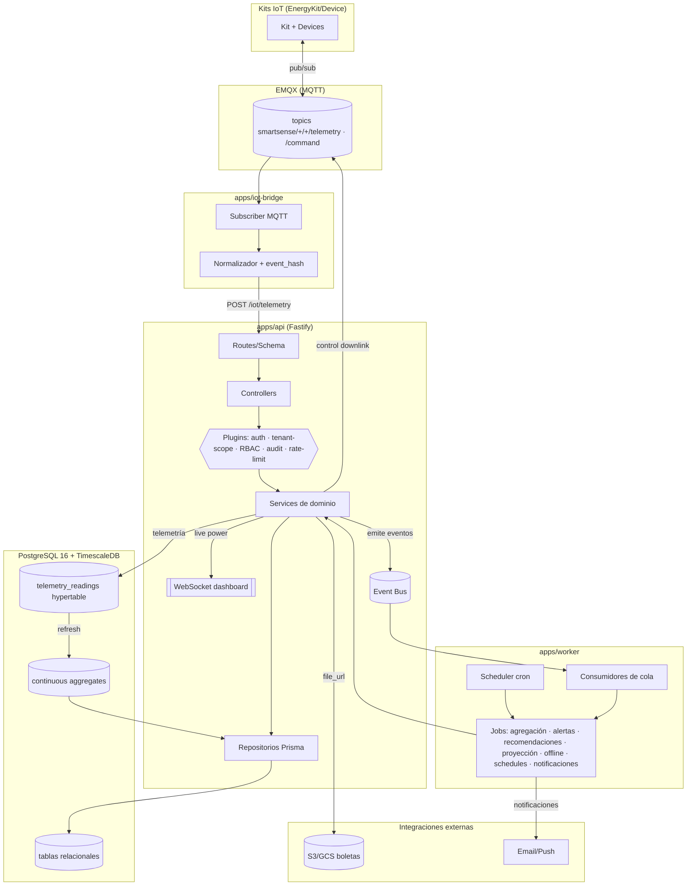

# Arquitectura Backend — SmartSense

> Deriva de `specs/_canon.md`, `specs/02-domain/domain-model.md`, `specs/03-data-model/relational-model.md` y `specs/04-api/api-overview.md`.
> Stack canónico: Node.js + Fastify + TypeScript + Prisma + PostgreSQL 16 / TimescaleDB. IoT: MQTT (EMQX) → iot-bridge → API; WebSocket para dashboard. Monorepo pnpm.

## 1. Principios

- **Capas estrictas**: `routes/controllers → services de dominio → repositorios Prisma → DB`. Una capa solo conoce la inmediatamente inferior. Los controllers no tocan Prisma; los servicios no conocen Fastify (`request`/`reply`).
- **Multi-tenant por diseño**: ninguna query cruza `organization_id` (invariante de canon). El scoping se aplica en un middleware transversal y se propaga como `TenantContext` a la capa de servicio/repositorio.
- **Costos siempre en backend**: el cálculo de CLP vive en `BillingService`/`TariffService`. El frontend nunca envía ni recibe lógica de costo, solo valores ya calculados.
- **Idempotencia y append-only**: telemetría idempotente por `event_hash`; `audit_logs` append-only (solo INSERT).
- **SOLID + clean code**: lógica de negocio aislada en servicios, acceso a datos en repositorios, side effects (MQTT, email, WS) tras interfaces (puertos/adaptadores).
- **Determinismo de costos**: dado el mismo input (kWh + tarifa/boleta), el costo CLP es reproducible.

## 2. Organización del monorepo (pnpm)

```
apps/
  api/            # Servidor Fastify (HTTP/REST + WebSocket). Núcleo de negocio.
    src/
      modules/    # Un módulo por bounded context (auth, installations, devices, telemetry, billing, dashboard, reports, breakdown, alerts, recommendations, control, notifications, audit)
        <mod>/
          <mod>.routes.ts       # Definición de rutas + schema Fastify (validación)
          <mod>.controller.ts   # Orquesta request→service→reply; sin lógica de negocio
          <mod>.service.ts      # Lógica de dominio
          <mod>.repository.ts   # Acceso Prisma (queries scoped por tenant)
          <mod>.schema.ts       # Zod/JSON Schema (request/response)
          <mod>.events.ts       # Definición de eventos de dominio emitidos
      plugins/    # Fastify plugins: auth, tenant-scope, rbac, audit-hook, error-handler, rate-limit, ws
      jobs/       # Definición de jobs (registro, no ejecución; ver apps/worker)
      lib/        # event-bus, logger, prisma-client wrapper, config
      server.ts
  worker/         # Proceso separado: consumidores de cola + scheduler de jobs (ver jobs-and-workers.md)
  iot-bridge/     # Suscriptor MQTT (EMQX) → valida/normaliza → POST /iot/telemetry o publica a cola
  web/            # Next.js (fuera de alcance de este doc)
packages/
  shared/         # Tipos compartidos, enums (espejo del canon), contratos DTO, utilidades de hash (event_hash)
  db/             # Schema Prisma, migraciones, seeds, helpers Timescale (continuous aggregates, políticas)
```

- `apps/api` y `apps/worker` comparten `packages/db` (mismo schema Prisma) y `packages/shared`.
- Los enums viven una sola vez en `packages/shared` y reflejan exactamente los **enums canónicos**; nunca se redefinen por módulo.

## 3. Capas (responsabilidades)

| Capa | Responsabilidad | Conoce | NO conoce |
|---|---|---|---|
| Routes | Mapeo URL→handler, schema de validación (Fastify), rol mínimo (RBAC), rate-limit | Controller | Prisma, lógica |
| Controller | Extraer/parsear request, invocar servicio con `TenantContext`, mapear resultado/errores a HTTP | Service, DTOs | Prisma directo |
| Service (dominio) | Reglas de negocio, invariantes, orquestación de repositorios, emisión de eventos | Repositorios, otros servicios, event-bus | `request`/`reply` de Fastify |
| Repository | Queries Prisma scoped por tenant, mapeo entidad↔DTO | PrismaClient | Reglas de negocio |
| DB | PostgreSQL 16 + TimescaleDB | — | — |

## 4. Diagrama de arquitectura



## 5. Estrategia de ingestión IoT

- **Flujo**: `Device → MQTT (EMQX) → iot-bridge → POST /iot/telemetry → TelemetryIngestionService → telemetry_readings`. Contrato completo en `specs/07-iot/mqtt-or-ingestion-contract.md`.
- `iot-bridge` autentica por credenciales de kit (token scope `telemetry:ingest`), normaliza el payload MQTT al DTO de ingestión, calcula/verifica `event_hash` y llama a la API. No escribe en DB directo (mantiene el cálculo de costo y validación en un único punto).
- **Idempotencia**: `UNIQUE(event_hash)` en `telemetry_readings`. Reinserción del mismo hash → `ingestion_status=duplicate`, no se inserta de nuevo. Header `Idempotency-Key` adicional para reintentos de transporte.
- **Validación de ingestión** (`TelemetryIngestionService`): no-negativos (`active_power_w`, `current_a`, `voltage_v`, `apparent_power_va`, `energy_wh_delta >= 0`), `power_factor ∈ [-1,1]`, `source_timestamp` no excesivamente futuro (tolerancia de reloj, ej. +120s) → si falla, `ingestion_status=invalid` + `422`.
- **Backpressure**: ante volumen alto la ingestión puede encolarse (cola por kit) y procesarse en lote; el bridge bufferea offline (ver contrato IoT). Endpoint con cuota mayor por kit (rate-limit dedicado).
- Cada lectura aceptada emite `telemetry.ingested` (consumido por evaluación de alertas y refresh de agregados en vivo) o `telemetry.rejected`.

## 6. Estrategia de agregación (Timescale + workers)

- **Capa 1 — Continuous Aggregates de TimescaleDB**: vistas materializadas continuas sobre `telemetry_readings` que precalculan, por `(installation_id, device_id, bucket)`: `SUM(energy_wh_delta)→kwh`, `MAX(active_power_w)→peak_power_w`. Granularidades base: `hour`. Política `add_continuous_aggregate_policy` refresca incrementalmente.
- **Capa 2 — Workers de rollup y costeo**: un job periódico (ver `jobs-and-workers.md`) lee los continuous aggregates de hora, los consolida a `day/week/month`, **calcula `cost_clp` vía `BillingService`** (Timescale agrega kWh pero no conoce tarifas) y hace UPSERT en `energy_aggregates` por la clave única `(installation_id, device_id, category_id, granularity, bucket_start)`.
- **Recálculo**: `energy_aggregates` es siempre recalculable desde telemetría/continuous aggregates; el recálculo es idempotente (UPSERT por clave) y registra `recomputed_at`. Emite `aggregate.recomputed`.
- **Por qué dos capas**: Timescale resuelve volumen y SUM/peak eficientemente; el costo CLP y el groupBy por categoría/tarifa vigente son lógica de dominio que no debe vivir en SQL de la vista.

## 7. Estrategia de cálculo de costos (centralizada)

- Toda conversión kWh→CLP pasa por **`BillingService.computeCost()`**, único punto del sistema con esa lógica.
- Fuente de tarifa, en orden de prioridad: (1) `installations.tariff_id` vigente (`TariffService`); (2) tarifa derivada de la última `electricity_bill` confirmada de la instalación; (3) sin base → `cost_clp = null` + `tariff_configured: false` (canon: nunca se inventa CLP).
- Modelo de costo: `energy_kwh * energy_price_clp_kwh` (+ `fixed_charge_clp` prorrateado y `demand_charge_clp_kw * peak_kw` cuando la tarifa los define y la granularidad corresponde, ej. cargo fijo solo en bucket `month`).
- Consumido por: agregación (rollup), dashboard, reportes, desglose, alertas (`estimated_impact_clp`), recomendaciones (`estimated_saving_clp`).

## 8. Estrategia de alertas

- `AlertService` evalúa cuatro tipos del enum `alert_type`:
  - `anomaly`: desviación vs. baseline histórico del mismo bucket (ej. >Nσ sobre media móvil).
  - `high_device`: device con consumo desproporcionado vs. su histórico o vs. el total de la instalación.
  - `over_budget`: proyección mensual o consumo acumulado supera presupuesto/`consumption_limits`.
  - `offline`: device sin telemetría dentro de la ventana esperada (`last_seen_at`).
- Disparo: combinación de **streaming** (evento `telemetry.ingested` → evaluación rápida de umbrales/limites) y **batch** (job periódico para anomalía/proyección). Ver `jobs-and-workers.md`.
- Toda alerta nace `open` con `severity`; deduplicación para no re-emitir mientras una alerta equivalente sigue `open`. Emite `alert.raised` → puede generar `Notification` y `Recommendation`.

## 9. Estrategia de recomendaciones

- `RecommendationService` con dos `recommendation_source`:
  - `alert`: generada al resolver/evaluar una alerta (ej. `high_device` → "revisar dispositivo X").
  - `periodic_analysis`: job periódico que analiza desglose/patrones y propone ahorros.
- `estimated_saving_clp` se calcula vía `BillingService`; sin tarifa/boleta base se omite el campo CLP (canon). Orden por `priority` + impacto.

## 10. Autenticación / Autorización

- **AuthN**: JWT access (corto) + refresh (rotación). `auth` plugin valida el access token, expone `request.auth = { userId, activeOrg, memberships }`. Refresh tokens revocables (logout invalida).
- **Tenant scoping**: `tenant-scope` plugin deriva `organization_id` activo del claim `org` y/o del path; construye `TenantContext` inyectado a servicios/repositorios. Todo repositorio filtra por `organization_id` (directo o vía FK). Acceso cruzado → `404 NOT_FOUND` o `403 CROSS_TENANT_DENIED`.
- **RBAC**: `rbac` plugin valida el rol mínimo declarado por ruta contra `membership_role` (`owner|admin|operator|viewer`). Control remoto y claim de kit requieren `operator|admin|owner`. Denegación de control por rol insuficiente igualmente se audita.
- **Ingesta IoT**: token de kit (no usuario) con scope `telemetry:ingest`, validado en `/iot/telemetry`.

## 11. Auditoría

- `audit` plugin (interceptor) registra acciones sensibles en `audit_logs` (append-only): control (`control.*`), cambios de rol (`membership.role_changed`), claim/transfer de kit (`kit.claimed`, `kit.transferred`), cambios de tarifa/estado de instalación.
- Captura `before`/`after` (jsonb), `user_id`, `organization_id`, `ip`. Implementado vía `AuditService` invocado por los servicios de dominio (no por el repositorio), para registrar la intención de negocio. `audit_logs` protegido contra UPDATE/DELETE (trigger).

## 12. Logging (estructurado)

- Logger estructurado JSON (pino, nativo de Fastify) con `request_id`, `organization_id`, `user_id`/`kit_id`, `route`, `latency_ms`, `status`.
- Niveles: `error|warn|info|debug`. Nunca se loguean secrets, `password_hash`, ni tokens. El `raw_payload` de telemetría no se loguea completo en `info`.
- Correlación: `request_id` propagado a eventos de dominio y a jobs/workers que esos eventos disparan.

## 13. Testing

- **Unit**: servicios de dominio con repositorios y puertos (MQTT/email/S3) mockeados. Cubre reglas e invariantes (no-cross-tenant, costo determinista, idempotencia por `event_hash`, no eliminar último owner, kit no `active` en dos instalaciones).
- **Integration**: API + Prisma contra PostgreSQL/TimescaleDB efímero (testcontainers). Cubre ingestión idempotente, rollup de agregados con costeo, scoping multi-tenant end-to-end, flujo de control con auditoría.
- **Contrato**: validación de payloads contra `openapi.yaml` y contra el contrato de telemetría.
- Datos de prueba vía seeds de `packages/db`. CI: lint (ESLint) + unit + integration en GitHub Actions.
