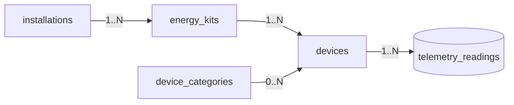

# Modelo de Dispositivo IoT — SmartSense

> Deriva de `specs/_canon.md`, `specs/02-domain/domain-model.md` y `specs/03-data-model/relational-model.md`.
> Mapea a las tablas `energy_kits` y `devices` del canon. No introduce campos fuera del modelo relacional.

## 1. Conceptos

- **EnergyKit** (`energy_kits`): hardware identificado por QR (`qr_code`), claimado a una `installation`. Agrupa uno o más devices. Estados: `unclaimed | active | transferring | retired`. Ver `device-provisioning.md`.
- **Device** (`devices`): unidad física medible/controlable dentro de un kit. Identificada en el broker por `external_ref` (único por kit: `UNIQUE(kit_id, external_ref)`). Denormaliza `installation_id` para scoping multi-tenant directo.



## 2. Tipos de dispositivo

El tipo es funcional y se expresa por `capabilities` (jsonb) + `category_id` (catálogo de desglose), no por un enum dedicado (el canon no define un enum de tipo de device):

| Tipo lógico | `capabilities` | Mide | Controla | Ejemplo |
|---|---|---|---|---|
| Medidor de circuito | `{ "meter": true, "switch": false }` | sí (V/A/W/Wh) | no | medición de un circuito/tablero |
| Enchufe inteligente (switch) | `{ "meter": true, "switch": true }` | sí | sí (on/off, set_limit) | enchufe medidor con relé |
| Sensor | `{ "meter": false, "switch": false, "sensor": "<tipo>" }` | señales auxiliares | no | sensor ambiental/auxiliar |

- `capabilities.meter=true` → el device emite telemetría energética (`telemetry_readings`).
- `capabilities.switch=true` → el device acepta `control_actions` (`turn_on|turn_off|set_limit`) y `control_schedules`.
- Un `sensor` puro no produce energía agregable; sus señales van en `raw_payload`/`signal_quality`.

## 3. Capabilities (jsonb)

```json
{
  "meter": true,
  "switch": true,
  "channels": ["active_power_w", "energy_wh_delta", "voltage_v", "current_a"],
  "max_power_w": 3680,
  "sensor": null
}
```

- `meter`/`switch`: flags booleanos que habilitan ingestión y control respectivamente.
- `channels`: campos del contrato de telemetría que el device reporta (subset; ver `telemetry-model.md`).
- `max_power_w`: opcional, límite físico para validar lecturas/límites.
- Se valida que los `control_actions` solo se acepten si `switch=true`; la telemetría solo si `meter=true`.

## 4. Relación kit ↔ device

- `devices.kit_id` → `energy_kits.id` (`ON DELETE CASCADE`): retirar/eliminar el kit arrastra sus devices.
- `devices.installation_id` → `installations.id`: denormalizado; debe coincidir con `energy_kits.installation_id` del kit en estado `active`.
- Alta de device vía `DevicePairing` (estados `paired|recommended|scanning|unpaired|error`) durante el onboarding; al confirmar pairing se crea el `Device` con `UNIQUE(kit_id, external_ref)`.

## 5. Estados del dispositivo (`device_state`)

Enum canónico `device_state`: `online | offline | unknown`.

| Estado | Significado | Transición |
|---|---|---|
| `unknown` | recién creado / sin lectura aún | inicial (`DEFAULT 'unknown'`) |
| `online` | telemetría reciente dentro de ventana | al ingestar lectura válida (`DeviceService.markSeen`) → `device.online` |
| `offline` | sin telemetría más allá de la ventana esperada | job offline detector (`last_seen_at`) → `device.offline` + alerta `offline` |

- `last_seen_at` (`timestamptz NULL`) se actualiza en cada ingestión válida y es la base de la detección offline (ver `jobs-and-workers.md` job 7).
- Ventana de offline derivada de la frecuencia esperada de telemetría (`telemetry-model.md`): si supera N intervalos sin lectura → `offline`.
- El retorno de telemetría reestablece `online` automáticamente.

## 6. Firmware

- `energy_kits.firmware_version` y `devices` reportan versión; la telemetría incluye `firmware_version` por lectura (`telemetry_readings.firmware_version`) para trazabilidad.
- Cambios de firmware quedan reflejados al recibir lecturas con nueva versión; no hay tabla dedicada (campo en kit + por lectura).

## 7. Invariantes

- Un device pertenece a exactamente un kit; su `installation_id` coincide con el del kit `active`.
- Telemetría solo aceptada si el device pertenece a un kit válido y `capabilities.meter=true`.
- Control solo aceptado si `capabilities.switch=true` y rol `operator|admin|owner`.
- Multi-tenant: toda query de device filtra por `installation_id`/`organization_id`.
