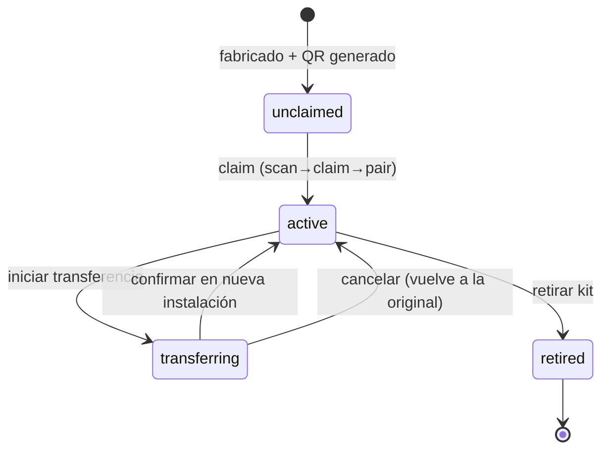
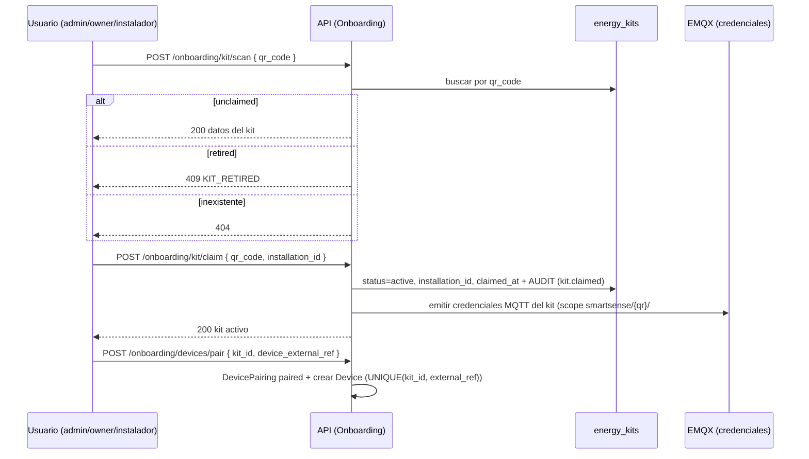

# Aprovisionamiento de Kits (Provisioning) — SmartSense

> Deriva de `specs/_canon.md`, `specs/02-domain/domain-model.md` (EnergyKit), `device-model.md`, `mqtt-or-ingestion-contract.md` y `04-api/api-overview.md` (grupo Onboarding).
> Cubre el ciclo de vida del `energy_kits` desde la fábrica hasta el retiro, y la emisión/rotación de credenciales MQTT.

## 1. Estados del kit (`energy_kits.status`)

Enum canónico: `unclaimed | active | transferring | retired`.

| Estado | Significado |
|---|---|
| `unclaimed` | fabricado, QR emitido, sin instalación (`installation_id` NULL) |
| `active` | claimado y operativo en una instalación |
| `transferring` | en proceso controlado de cambio de instalación |
| `retired` | fuera de servicio; no acepta telemetría ni claim |

## 2. Generación del QR del kit

- En fábrica/aprovisionamiento se genera `qr_code` (`UNIQUE`), `serial` y `model`; estado inicial `unclaimed`, `installation_id = NULL`.
- `qr_code` opaco e impredecible (no secuencial): identificador de alta entropía (ej. `SS-KIT-<base32>`), no adivinable, para evitar enumeración/claim malicioso.
- El QR codifica solo `qr_code` (referencia), **no** credenciales MQTT (estas se emiten al claim, server-side).

## 3. Flujo scan → claim → pair

1. **scan** (`POST /onboarding/kit/scan`): valida `qr_code`. `unclaimed`→datos del kit; inexistente→404; `retired`→409; `active` en otra instalación→409 `KIT_ALREADY_CLAIMED`.
2. **claim** (`POST /onboarding/kit/claim`): rol `admin|owner`. Liga el kit a la instalación → `status=active`, `claimed_at`, `installation_id`; **emite credenciales MQTT** del kit; registra `kit.claimed` en `audit_logs`.
3. **pair** (`POST /onboarding/devices/pair`): por cada device descubierto, `DevicePairing` (`recommended|scanning|paired|...`) y al aceptar crea `Device` con `UNIQUE(kit_id, external_ref)`.

## 4. Credenciales MQTT por kit

- Emitidas al **claim** (no antes): usuario/clave MQTT o certificado mTLS ligado al `qr_code`. ACL del broker restringe al prefijo `smartsense/{qr_code}/#` (ver `mqtt-or-ingestion-contract.md` §3).
- Secret nunca expuesto al frontend (canon): se entrega de forma segura al kit en el aprovisionamiento físico / pairing inicial; el backend solo guarda la referencia/hash necesario para validar en el broker.
- Scope mínimo: el kit solo publica telemetría/ack y recibe comandos bajo su prefijo; nunca accede a otros tenants.

## 5. Rotación de credenciales

- Rotación bajo: `transfer`, `retire`, sospecha de compromiso, o política periódica.
- Proceso: emitir nueva credencial → propagar al kit → revocar la anterior en el broker (ventana de gracia corta para evitar pérdida de telemetría). Queda auditado.
- La rotación **no** cambia `qr_code` ni el historial de telemetría (sigue ligado a `device_id`/`event_hash`).

## 6. Transferencia controlada entre instalaciones

Regla de canon/dominio: **un kit no puede estar `active` en dos instalaciones a la vez** (constraint: a lo sumo una fila `status='active'` por `serial`).

Flujo:
1. Origen inicia transferencia → kit `active` → `transferring` (queda fuera de servicio operacional, no acepta nueva telemetría como `active`).
2. Destino confirma en la nueva instalación → `transferring` → `active` con nuevo `installation_id`; se **rotan credenciales MQTT**; `devices.installation_id` se reasigna al nuevo sitio.
3. Cancelación → vuelve a `active` en la instalación original (credenciales rotadas igualmente por seguridad).
- En ningún punto intermedio existen dos filas `active` para el mismo kit/serial. Cada paso (`kit.transferred`) queda en `audit_logs`.

## 7. Retiro del kit

- `active|transferring` → `retired`: revoca credenciales MQTT, deja de aceptar telemetría/claim, marca `deleted_at` si aplica (soft delete).
- Devices del kit quedan inactivos (`ON DELETE CASCADE` solo si se elimina físicamente; el retiro normal preserva el histórico de telemetría para reportes).
- El histórico en `telemetry_readings`/`energy_aggregates` se conserva (no se borra al retirar).

## 8. Seguridad del aprovisionamiento

- `qr_code` de alta entropía + estado `unclaimed` → un atacante no puede reclamar kits ajenos sin el QR físico.
- Claim requiere rol `admin|owner` con membership activa; cross-tenant imposible (scoping).
- Credenciales MQTT con ACL por prefijo, rotables y revocables; emitidas solo al claim, nunca en el frontend.
- Todo `claim`/`transfer`/`retire` y la emisión/rotación de credenciales quedan en `audit_logs` (append-only).
- Re-claim de un kit ya `active` en otra instalación → bloqueado (`409 KIT_ALREADY_CLAIMED`), evitando secuestro de telemetría.
